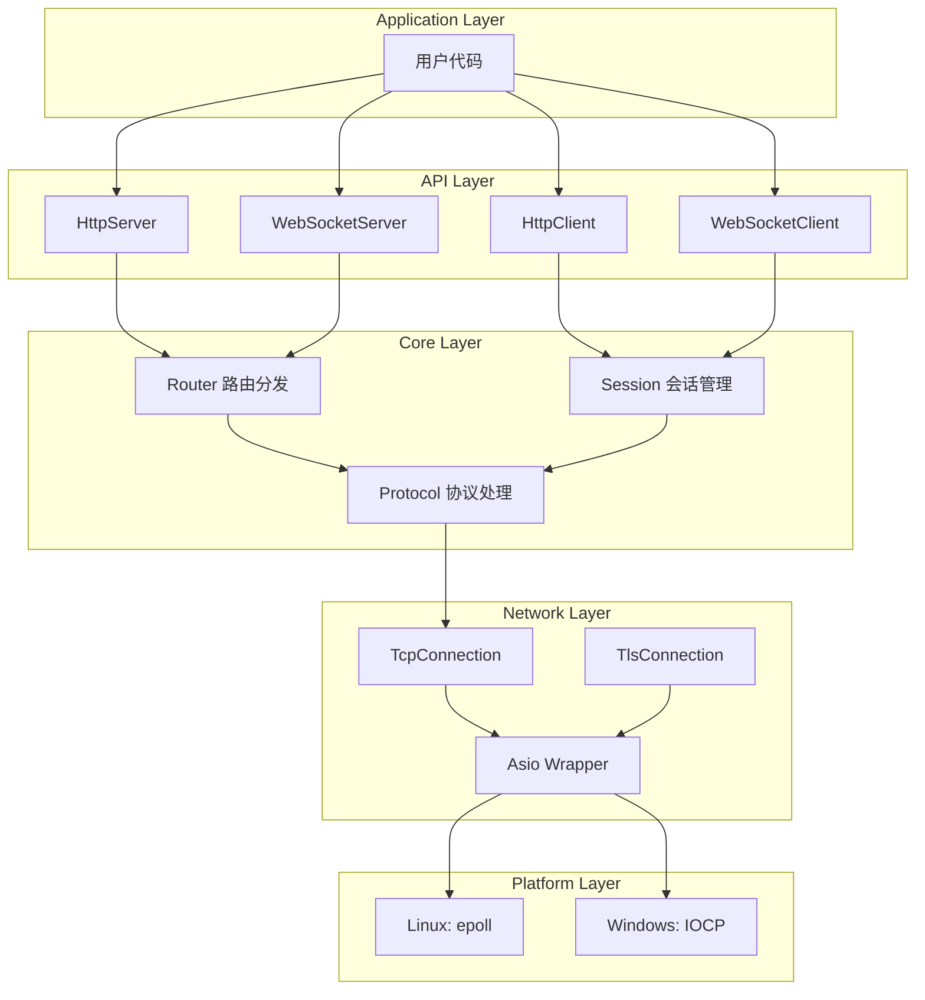
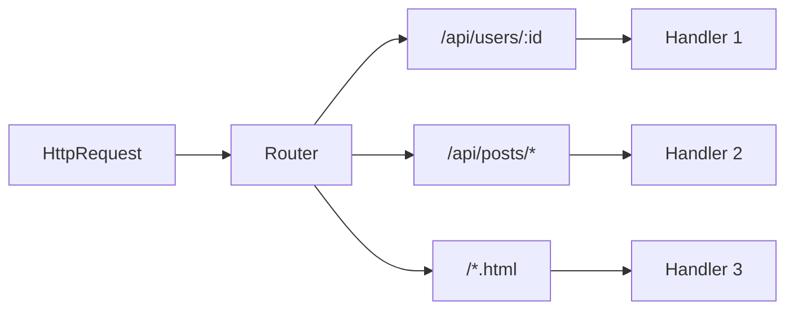
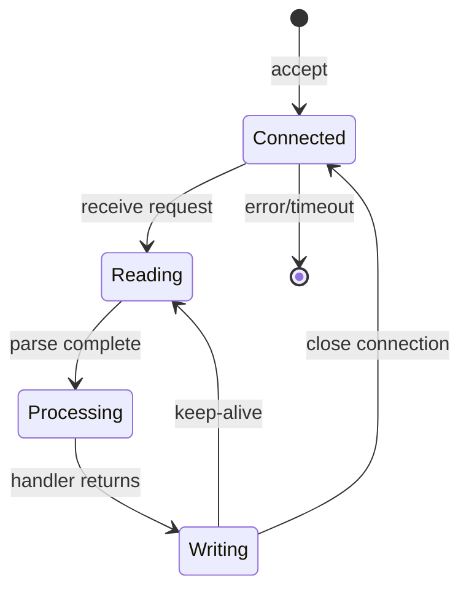
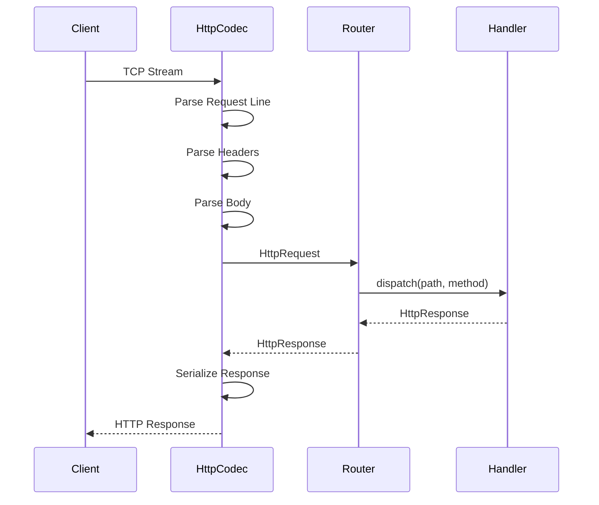
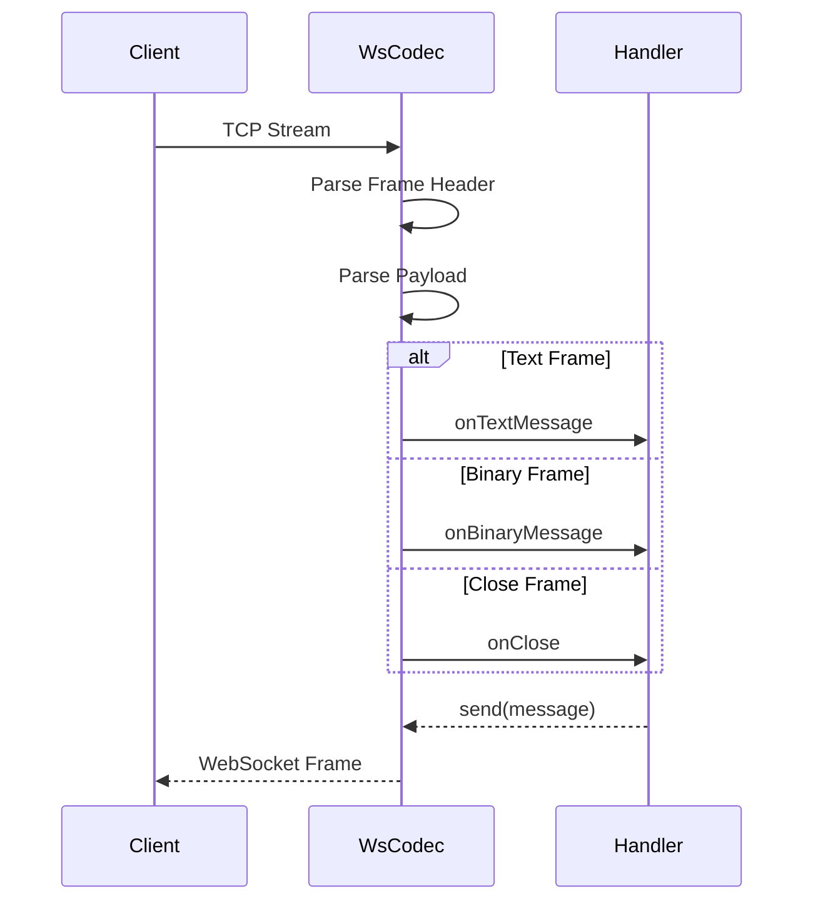

# C++ HTTP服务库技术设计文档

Feature Name: cpp-http-library
Updated: 2026-04-03

## 1. 概述

本设计文档描述高性能C++ HTTP服务库的技术架构，提供HTTP Server/Client和WebSocket Server/Client功能，支持同步/异步操作，采用Future/Promise异步模型，基于Boost.Asio实现跨平台网络通信。

## 2. 架构设计

### 2.1 整体架构图



### 2.2 组件层次

```
┌─────────────────────────────────────────────┐
│              API Layer (接口层)               │
│  HttpServer  HttpClient  WsServer  WsClient │
└─────────────────────────────────────────────┘
                      │
┌─────────────────────────────────────────────┐
│            Core Layer (核心层)               │
│  Router  Session  Protocol  Buffer  Codec  │
└─────────────────────────────────────────────┘
                      │
┌─────────────────────────────────────────────┐
│          Network Layer (网络层)              │
│       AsioWrapper  Connection  Socket       │
└─────────────────────────────────────────────┘
                      │
┌─────────────────────────────────────────────┐
│         Platform Layer (平台适配层)          │
│         epoll / kqueue / IOCP              │
└─────────────────────────────────────────────┘
```

### 2.3 目录结构

```
include/
└── cpphttp/
    ├── cpphttp.hpp              # 主头文件
    ├── version.hpp              # 版本信息
    ├── config.hpp               # 配置类
    ├── buffer.hpp               # 缓冲区
    ├── error.hpp                # 错误定义
    │
    ├── api/
    │   ├── http_server.hpp      # HTTP Server接口
    │   ├── http_client.hpp      # HTTP Client接口
    │   ├── ws_server.hpp        # WebSocket Server接口
    │   └── ws_client.hpp        # WebSocket Client接口
    │
    ├── core/
    │   ├── router.hpp           # 路由分发
    │   ├── session.hpp          # 会话管理
    │   ├── connection.hpp       # 连接管理
    │   └── codec/
    │       ├── http_codec.hpp   # HTTP编解码
    │       └── ws_codec.hpp     # WebSocket编解码
    │
    └── platform/
        └── asio_wrapper.hpp    # Asio封装

src/
├── cpphttp.cpp
├── api/
│   ├── http_server.cpp
│   ├── http_client.cpp
│   ├── ws_server.cpp
│   └── ws_client.cpp
├── core/
│   ├── router.cpp
│   ├── session.cpp
│   ├── connection.cpp
│   └── codec/
│       ├── http_codec.cpp
│       └── ws_codec.cpp
└── platform/
    └── asio_wrapper.cpp
```

## 3. 核心接口设计

### 3.1 HttpServer

```cpp
class HttpServer {
public:
    HttpServer();
    ~HttpServer();
    
    // 同步接口
    void start(const std::string& host, uint16_t port);
    void stop();
    
    // 异步接口
    std::future<void> startAsync(const std::string& host, uint16_t port);
    std::future<void> stopAsync();
    
    // 路由注册
    auto route(HttpMethod method, const std::string& path, Handler handler) -> HttpServer&;
    auto get(const std::string& path, Handler handler) -> HttpServer&;
    auto post(const std::string& path, Handler handler) -> HttpServer&;
    auto put(const std::string& path, Handler handler) -> HttpServer&;
    auto delete_(const std::string& path, Handler handler) -> HttpServer&;
    
    // 配置
    auto setNumThreads(size_t n) -> HttpServer&;
    auto setMaxConnections(size_t max) -> HttpServer&;
    auto setRequestTimeout(std::chrono::seconds timeout) -> HttpServer&;
    
    // WebSocket支持
    auto onWsConnect(std::function<void(WsSession*)> callback) -> HttpServer&;
};
```

### 3.2 HttpClient

```cpp
class HttpClient {
public:
    HttpClient();
    explicit HttpClient(const std::string& baseUrl);
    ~HttpClient();
    
    // 同步接口
    Response get(const std::string& path);
    Response post(const std::string& path, const std::string& body);
    Response put(const std::string& path, const std::string& body);
    Response delete_(const std::string& path);
    
    // 异步接口
    std::future<Response> getAsync(const std::string& path);
    std::future<Response> postAsync(const std::string& path, const std::string& body);
    std::future<Response> putAsync(const std::string& path, const std::string& body);
    std::future<Response> deleteAsync(const std::string& path);
    
    // 配置
    auto setTimeout(std::chrono::seconds timeout) -> HttpClient&;
    auto setKeepAlive(bool enabled) -> HttpClient&;
    auto setHeader(const std::string& key, const std::string& value) -> HttpClient&;
};
```

### 3.3 WebSocketServer

```cpp
class WebSocketServer {
public:
    WebSocketServer();
    ~WebSocketServer();
    
    // 同步接口
    void start(uint16_t port);
    void stop();
    
    // 异步接口
    std::future<void> startAsync(uint16_t port);
    std::future<void> stopAsync();
    
    // 事件处理
    auto onConnect(std::function<void(WsSession*)> callback) -> WebSocketServer&;
    auto onMessage(std::function<void(WsSession*, const std::string&)> callback) -> WebSocketServer&;
    auto onBinary(std::function<void(WsSession*, const std::vector<uint8_t>&)> callback) -> WebSocketServer&;
    auto onClose(std::function<void(WsSession*, uint16_t)> callback) -> WebSocketServer&;
    auto onError(std::function<void(WsSession*, const Error&)> callback) -> WebSocketServer&;
    
    // 发送接口
    void send(WsSession* session, const std::string& message);
    void send(WsSession* session, const uint8_t* data, size_t len);
    void close(WsSession* session, uint16_t code = 1000);
};
```

### 3.4 WebSocketClient

```cpp
class WebSocketClient {
public:
    WebSocketClient();
    ~WebSocketClient();
    
    // 连接
    void connect(const std::string& uri);
    std::future<void> connectAsync(const std::string& uri);
    void close(uint16_t code = 1000);
    
    // 发送
    void send(const std::string& message);
    void send(const uint8_t* data, size_t len);
    
    // 事件
    auto onConnect(std::function<void()> callback) -> WebSocketClient&;
    auto onMessage(std::function<void(const std::string&)> callback) -> WebSocketClient&;
    auto onBinary(std::function<void(const std::vector<uint8_t>&)> callback) -> WebSocketClient&;
    auto onClose(std::function<void(uint16_t)> callback) -> WebSocketClient&;
    auto onError(std::function<void(const Error&)> callback) -> WebSocketClient&;
};
```

## 4. 数据模型

### 4.1 HttpRequest

```cpp
struct HttpRequest {
    HttpMethod method;           // GET, POST, PUT, DELETE, etc.
    std::string path;             // /api/users
    std::string query;           // ?id=123
    HttpVersion version;          // HTTP/1.1
    std::string_view headers;    // 请求头映射
    std::string_view body;       // 请求体
    std::string remoteAddr;       // 客户端地址
    uint16_t remotePort;          // 客户端端口
};
```

### 4.2 HttpResponse

```cpp
struct HttpResponse {
    HttpVersion version;         // HTTP/1.1
    uint16_t statusCode;          // 200, 404, 500, etc.
    std::string statusMessage;    // OK, Not Found, etc.
    std::unordered_map<std::string, std::string> headers;
    std::string body;
    
    // 辅助方法
    auto setContentType(const std::string& type) -> HttpResponse&;
    auto setKeepAlive(bool enabled) -> HttpResponse&;
    auto setBody(const std::string& body) -> HttpResponse&;
};
```

### 4.3 WsSession

```cpp
class WsSession {
public:
    auto id() const -> uint64_t;
    auto remoteAddr() const -> std::string;
    auto remotePort() const -> uint16_t;
    auto send(const std::string& message) -> void;
    auto send(const uint8_t* data, size_t len) -> void;
    auto close(uint16_t code = 1000) -> void;
    auto keepAlive() -> void;
};
```

### 4.4 Buffer

```cpp
class Buffer {
public:
    Buffer();
    explicit Buffer(size_t capacity);
    
    auto write(const uint8_t* data, size_t len) -> void;
    auto read(size_t len) -> std::string_view;
    auto peek() const -> std::string_view;
    auto commitRead(size_t len) -> void;
    auto commitWrite(size_t len) -> void;
    auto retrieveAll() -> void;
    auto size() const -> size_t;
    auto capacity() const -> size_t;
    auto ensureWritable(size_t minSize) -> void;
};
```

## 5. 核心组件设计

### 5.1 Router

路由组件负责将HTTP请求分发到对应的处理器。



**匹配优先级：**
1. 精确匹配 > 参数匹配 > 通配符匹配
2. 相同优先级按注册顺序匹配

### 5.2 Session

会话组件管理连接状态和生命周期。



### 5.3 Connection Pool

连接池管理TCP连接复用。

```cpp
class ConnectionPool {
public:
    struct PooledConnection {
        TcpConnection connection;
        std::chrono::steady_clock::time_point lastUsed;
        bool inUse;
    };
    
    auto acquire(const std::string& host, uint16_t port) 
        -> std::future<PooledConnection>;
    auto release(PooledConnection conn) -> void;
    auto closeIdle(std::chrono::seconds maxIdle) -> size_t;
};
```

## 6. 协议处理

### 6.1 HTTP Codec



**关键点：**
- 使用状态机解析HTTP请求
- 零拷贝：使用string_view避免不必要拷贝
- 大body支持分块读取

### 6.2 WebSocket Codec



**关键点：**
- 帧头解析使用位运算优化
- Masking key处理（客户端发送必须mask）
- 消息分片重组

## 7. 错误处理

### 7.1 错误码定义

```cpp
enum class ErrorCode : uint32_t {
    // 系统错误 (0x00XX)
    Success = 0x0000,
    Unknown = 0x0001,
    OutOfMemory = 0x0002,
    
    // 网络错误 (0x01XX)
    NetworkError = 0x0100,
    ConnectionRefused = 0x0101,
    ConnectionTimeout = 0x0102,
    ConnectionReset = 0x0103,
    HostUnreachable = 0x0104,
    
    // HTTP错误 (0x02XX)
    HttpError = 0x0200,
    BadRequest = 0x0201,
    NotFound = 0x0202,
    MethodNotAllowed = 0x0203,
    InternalServerError = 0x0204,
    
    // WebSocket错误 (0x03XX)
    WsError = 0x0300,
    WsHandshakeFailed = 0x0301,
    WsInvalidFrame = 0x0302,
    WsProtocolError = 0x0303,
};
```

### 7.2 错误结构

```cpp
struct Error {
    ErrorCode code;
    std::string message;
    std::string details;
    
    auto toString() const -> std::string;
    auto isNetworkError() const -> bool;
    auto isHttpError() const -> bool;
    auto isWsError() const -> bool;
};
```

## 8. 性能优化策略

### 8.1 IO多路复用

```mermaid
graph TB
    subgraph epoll/kqueue
        EventLoop["Event Loop"]
        EpollWait["epoll_wait / kevent"]
    end
    
    subgraph Connections
        Conn1["Connection 1"]
        Conn2["Connection 2"]
        ConnN["Connection N"]
    end
    
    EventLoop --> EpollWait
    EpollWait --> Conn1 : read/write ready
    EpollWait --> Conn2 : read/write ready
    EpollWait --> ConnN : read/write ready
```

### 8.2 对象池

```cpp
class ObjectPool<T> {
public:
    auto acquire() -> std::unique_ptr<T>;
    auto release(T* obj) -> void;
    
private:
    std::vector<T*> available_;
    std::vector<T*> inUse_;
    std::mutex mutex_;
};
```

**对象池应用场景：**
- Buffer对象
- Session对象
- Request/Response对象

### 8.3 内存管理

| 优化点 | 实现方式 |
|--------|----------|
| 避免内存碎片 | 对象池 + slab分配器 |
| 减少拷贝 | 使用string_view/span |
| 预分配 | 初始化时预分配连接池 |
| 缓存 | LRU缓存热点数据 |

## 9. 使用示例

### 9.1 HTTP Server

```cpp
// 最简3行启动
HttpServer server;
server.get("/hello", [](auto& req, auto& res) {
    res.setBody("Hello World");
});
server.start("0.0.0.0", 8080);
```

### 9.2 HTTP Client

```cpp
// 同步请求
HttpClient client("http://example.com");
auto response = client.get("/api/users");

// 异步请求
auto future = client.getAsync("/api/users");
auto response = future.get();
```

### 9.3 WebSocket Server

```cpp
WebSocketServer wss;
wss.onConnect([](WsSession* session) {
    std::cout << "Client connected\n";
})
.onMessage([](WsSession* session, const std::string& msg) {
    session->send("Echo: " + msg);
})
.onClose([](WsSession* session, uint16_t code) {
    std::cout << "Connection closed\n";
});
wss.start(8080);
```

### 9.4 WebSocket Client

```cpp
WebSocketClient wsc;
wsc.onConnect([]() { std::cout << "Connected\n"; })
   .onMessage([](const std::string& msg) {
       std::cout << "Received: " << msg << "\n";
   });
wsc.connect("ws://localhost:8080");
```

## 10. 依赖关系

### 10.1 外部依赖

| 依赖 | 版本 | 用途 |
|------|------|------|
| Boost.Asio | >= 1.70 | 网络通信 |
| Boost.System | >= 1.70 | 错误处理 |
| CMake | >= 3.15 | 构建系统 |
| C++ Standard | >= 17 | 编译器要求 |

### 10.2 最小依赖

本库仅依赖Boost.Asio和Boost.System，编译后无运行时依赖。

## 11. 正确性属性

### 11.1 线程安全

- 所有公共接口线程安全
- 内部数据结构受锁保护
- 提供线程安全的事件回调

### 11.2 资源管理

- RAII原则管理所有资源
- 连接关闭时自动释放资源
- 异常安全保证

### 11.3 协议正确性

- HTTP/1.1协议完整实现
- WebSocket RFC 6455完整实现
- 握手过程严格验证

## 12. 测试策略

### 12.1 单元测试

- HTTP编解码测试
- WebSocket编解码测试
- 路由匹配测试
- 缓冲区测试

### 12.2 集成测试

- 并发连接测试
- 断线重连测试
- 协议交互测试

### 12.3 性能测试

- 10万+并发连接
- 吞吐量测试
- 内存占用测试
